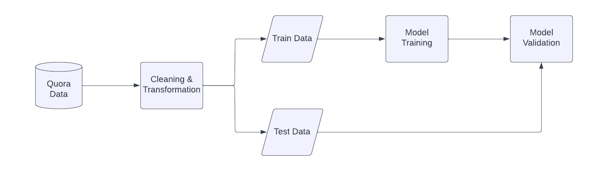
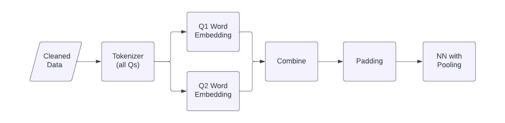
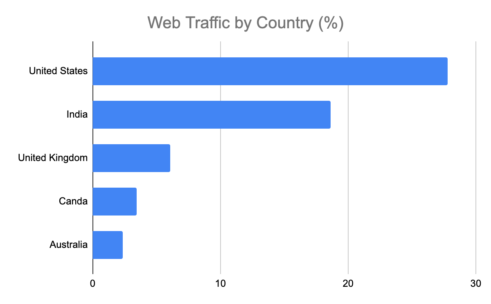
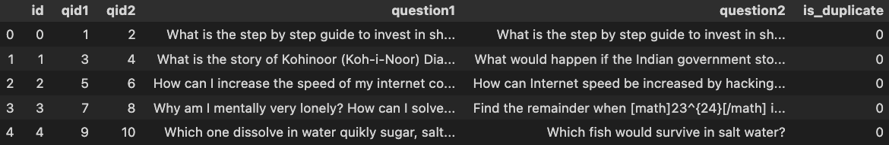
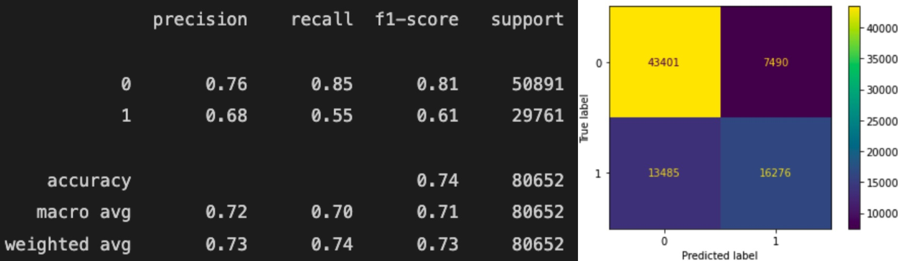
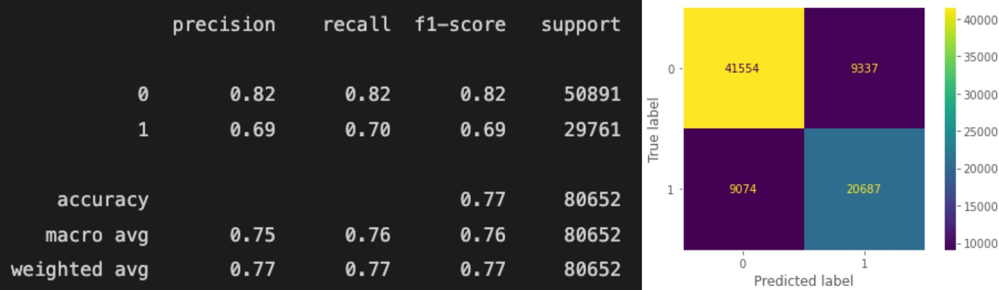

# **Quora_Similar_Q_Detection_NLP**
Over 100 million people visit Quora every month, so it's no surprise that many people ask similar (or the same) questions. Various questions with the same intent can cause people to spend extra time searching for the best answer to their question, and results in members answering multiple versions of the same question. Quora uses random forest to identify duplicated questions to provide a better experience to active seekers and writers and offer more value to both of these groups in the long term.
Follow the steps outlined below to build the appropriate classifier model. 

- **What**: An NLP project to detect similar questions from posts on Quora
- **How**: Through EDA, text processing, logistic regression & neutral network approach to modeling
- **Why**: Improves overall business model, externally with a better user experience in finding already answered questions and internally through reduced storage cost, faster response times, better targeted adds and many other factors. 

 

## **Process**
### General Approach Diagram

### Text Processing & Modeling Diagram

 

## **Data & Quora**
Some surprising statistics about the Quora platform: 
- Quora has 300 million monthly active users
- Quora has more than 190 million monthly active users
- Users spend on average 4:11 minutes on Quora
- 54% of the Quora users have an annual income of over $100,000

By web traffic Quora’s second largest user base is India after the United States 

  

This can be reflected in the types of frequent questions we see through the EDA process. For fun I made a word cloud in the shape of two question marks which is very on brand for this project :D Shoutout to the [Andreas Mueller]("https://github.com/amueller")

 

This is an example of the data working with for this project. 

 

## **Model Results**

### **Baseline Model: Logistic Regression**
After data processing I used a Logistic Regression model to get a baseline for my model improvements. With an accuracy of 0.74 but a recall for matched questions only being 0.55 there is room for improvement. 

 

### **Final Model: NN w Pooling**
After experimenting with different data processing / feature engineering & modeling techniques my final result provided more business value. With an accuracy of 0.86 and more importantly a higher recall of 0.70 for matched questions we are able to better identify similar questions. 

 

## Conclusion
There are many ways to approach an NLP problem. Even a relatively quick project such as this can provide a minimum viable product to a business to showcase what business value can be delivered. 

I would like to experiment with more approaches to processing and modeling this text data in the near future. 